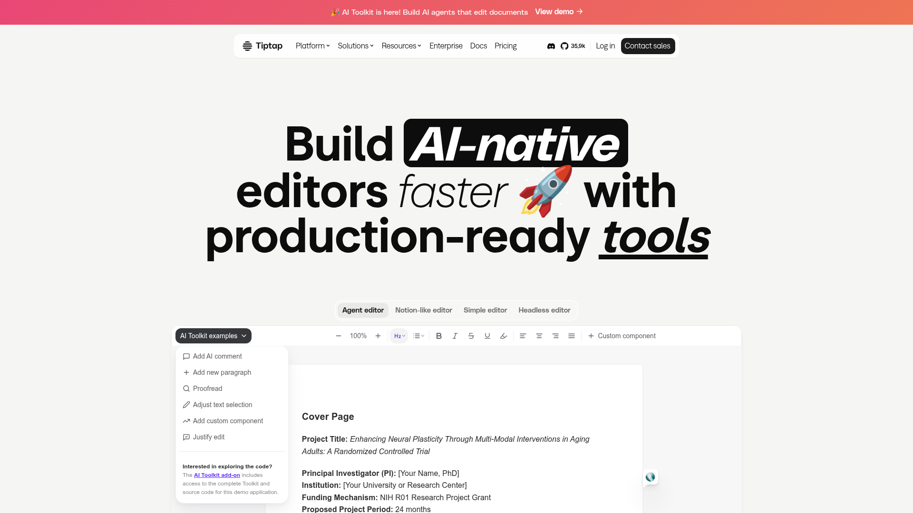
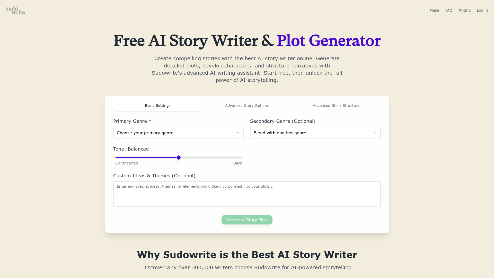
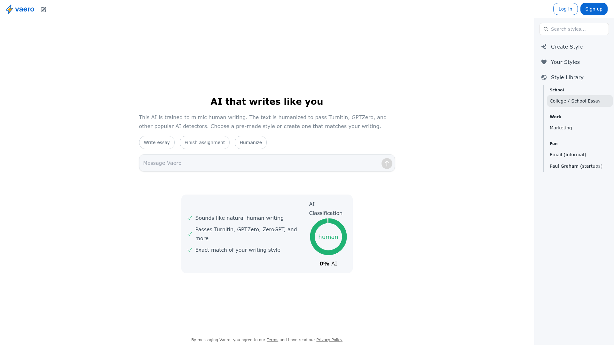
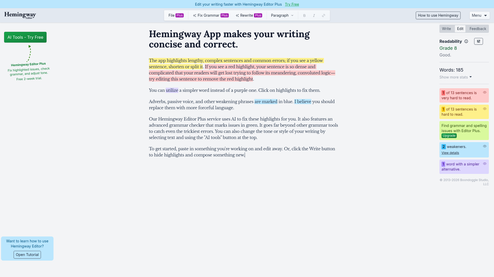

# Quick References: Writing Style Toolbar

## TL;DR

The best AI writing tools separate **style selection** (named presets), **intensity** (slider or degree control), and **apply action** (explicit convert button) — but they rarely cram all three into a single compact bar. Article-Flow's `WritingStyleToolbar` is on the right track; the references suggest making modes more scannable and pairing the toolbar with a contextual preview or analysis panel.

## Patterns

Leading products use one of three layouts for style/tone controls:

1. **Inline compact bar** — style dropdown + slider + action (closest to Article-Flow today)
2. **Sidebar mode picker** — vertical list of rewrite modes with live output preview (Quillbot)
3. **Editor + analysis rail** — writing canvas stays clean; quality metrics live in a right panel (Hemingway)

For Article-Flow specifically, the `风格 / 浓度 / 风格转换` trio maps cleanly to industry patterns. The shuyuan theme work benefits from treating the toolbar as a **craft instrument** (seal, brush weight) rather than a generic form control.

## Article-Flow mapping

Current toolbar (`WritingStyleToolbar.tsx`):

```
┌──────────────────────────────────────────────────────────────┐
│ 风格 [下拉] │ 浓度 [━━●━━] 72% │ 恢复正式 │ ✦ 风格转换      │
└──────────────────────────────────────────────────────────────┘
```

Recommended evolution informed by references:

```
┌──────────────────────────────────────────────────────────────┐
│ [正式] [幽默] [叙事] ...  │ 浓度 ━━●━━ 72%  │ ✦ 转换选中/全文 │
└──────────────────────────────────────────────────────────────┘
         ↑ segmented chips (Quillbot modes)     ↑ Sudowrite slider
```

## References

### Pattern A: Named rewrite modes (sidebar or chips)

*Quillbot — Sentence Rewriter* [Lazyweb, URL only — image token expired]

Toggleable modes: Standard, Fluency, Formal, Simple, Creative, Shorten, Expand. Each mode is a **first-class label**, not buried in a `<select>`. Users can scan options without opening a menu.

**Apply to Article-Flow:** Replace or supplement the style `<select>` with horizontal pill buttons for your top 4–5 styles from `writing_styles.yaml`. Keep the dropdown as overflow for long-tail styles.

### Pattern B: AI toolkit beside the editor



*Tiptap* — Notion-like AI editor with left sidebar toolkit (proofread, adjust selection, add comment). [Lazyweb]

Editor stays central; AI actions are grouped in a dedicated rail, not mixed with formatting chrome.

**Apply to Article-Flow:** Your writing page already has `AntiAiPanel`, `PlaybookPanel`, `SectionWriterPanel`. Consider docking `WritingStyleToolbar` adjacent to the editor header (not buried in a global nav) so style conversion feels like an **editor affordance**, not a settings control.

### Pattern C: Intensity as a continuous dial



*Sudowrite* — Story generator with genre dropdowns + **tone slider**. [Lazyweb]

Slider communicates gradation ("a little more / a lot more") better than discrete steps alone. Your `浓度` slider already does this — show the active style's `maxIntensity` cap visually (greyed track past cap).

### Pattern D: Style library as browsable catalog



*Vaero* — Searchable style library categorized by use case (essays, marketing, email, custom). [Lazyweb]

Users pick from **curated personas**, not abstract IDs. Each style card could show a one-line sample from `writing_styles.yaml` description.

**Apply to Article-Flow:** A lightweight popover from the style control showing `label` + `description` + example snippet would reduce trial-and-error before hitting「风格转换」.

### Pattern E: Editor + quality sidebar



*Hemingway* — Central editor with right rail for readability grade, word counts, and issue highlights. [Lazyweb]

The sidebar answers "how good is my draft?" without blocking writing flow.

**Apply to Article-Flow:** After style conversion, surface a compact diff summary or word-count delta in `AntiAiPanel` territory — users want confirmation the rewrite worked before committing.

## Suggested next steps for Article-Flow

| Priority | Change | Reference |
|----------|--------|-----------|
| High | Style pills for top presets + dropdown overflow | Quillbot |
| Medium | Show style description on hover/focus | Vaero |
| Medium | Grey slider track past per-style `maxIntensity` | Sudowrite |
| Low | Post-convert stats in side panel | Hemingway |

## Sources

All screenshots from Lazyweb MCP search queries:
- `writing editor with AI assist toolbar style controls` (desktop)
- `document editor sidebar AI rewrite tone style panel` (desktop)
